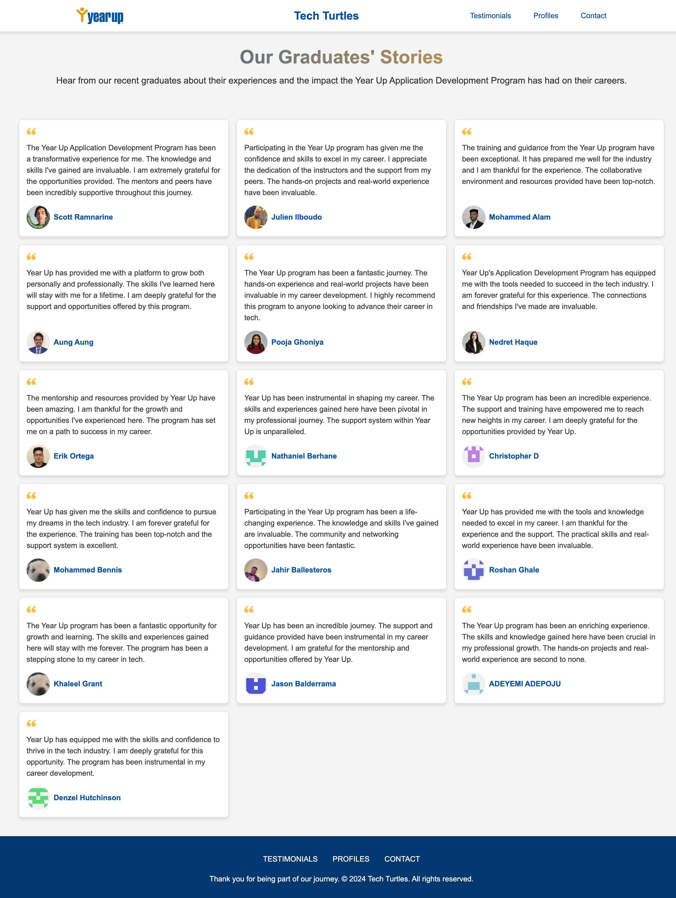

# Tech Turtles - Class Collaboration and Feedback

## Overview

Welcome to the Tech Turtles project! This project is a collaborative effort by our class to practice working together using GitHub and to share feedback about our experiences with the Year Up program. Through this platform, we aim to highlight the support and guidance provided by our professors, program managers, coach and essential skills instructors, as well as express our gratitude through testimonials.

## Features

- **Homepage**: Meet our dedicated and supportive Year Up team.
- **Testimonials**: Read feedback and thank you notes from students about their experiences and the support they've received from Year Up.
- **Profiles**: Discover the achievements and career journeys of our recent graduates.
- **Contact Us**: Get in touch with us for any suggestions or just to have a chat.

## Technologies Used

- HTML5
- CSS3
- JavaScript
- Nodemailer (for sending emails)

## Testimonials
